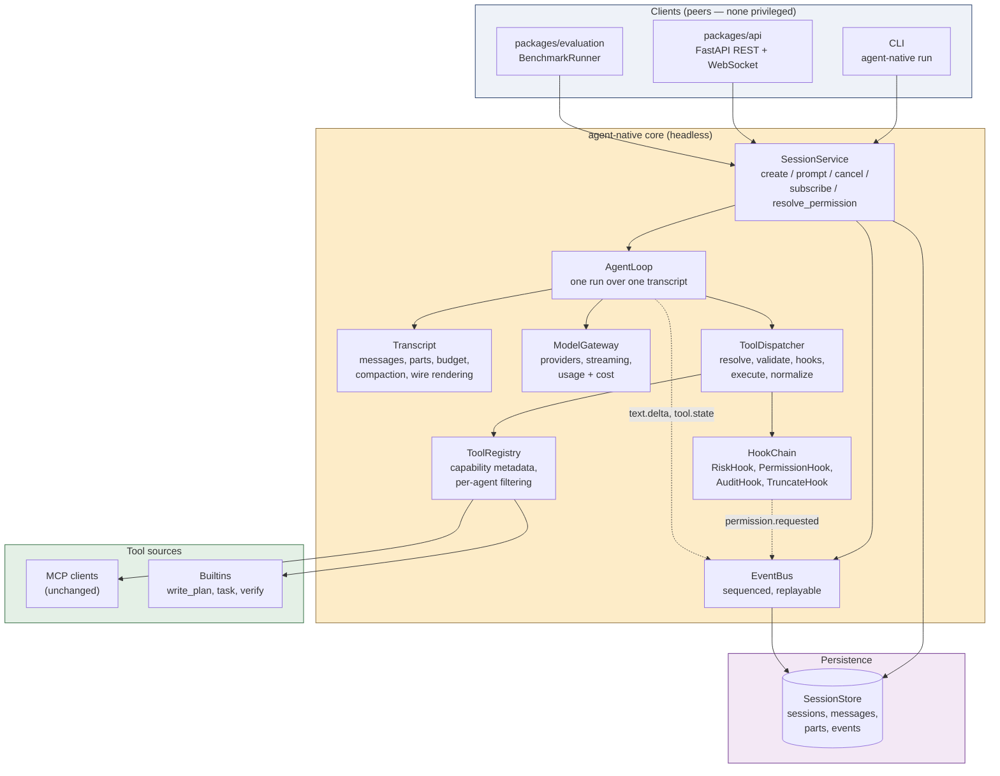
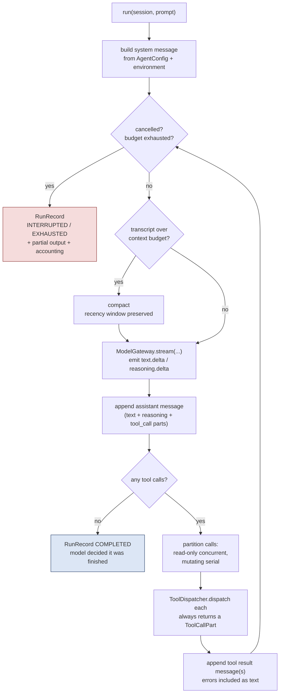
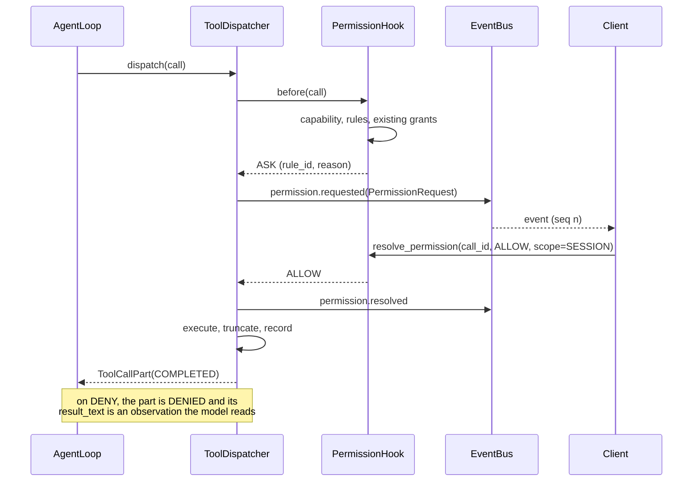

# agent-native v2 — target architecture

Redesign of `packages/agent-native`. This is a specification: component contracts, data
model, control flow and rationale. It is not an implementation plan for a rewrite — Part 12
maps every existing module to keep / change / retire, and Part 13 sequences the work so each
stage ships independently.

**Scope.** `mcp/__init__.py` and `packages/mcp-servers` are **out of scope** by instruction.
The design wraps the existing `MCPClient` protocol (`list_tools` / `call_tool` / `close`)
without altering it. Where a change would be *easier* with server-side support — notably tool
capability metadata — the design carries a local override table instead, and the dependency is
called out so it can be revisited later.

**Provenance and its limits.** The brief was "akin to a proper one like Hermes, OpenCode etc."
This environment has no network egress, so I could not read either project's current docs to
confirm specifics. What follows is built from the architectural properties I can defend from
knowledge through mid-2025 — OpenCode's client/server core, session/message/part data model,
config-driven pattern-matched permissions and named agent modes; the Hermes-family convention
of textual `<tool_call>` encoding for open models; and the single-loop, tools-for-everything
shape common to Claude Code and Codex. Where a named reference differs from what is described
here, treat the reference as correct and this document as needing a correction. The design
principles in Part 1 do not depend on any single implementation, and each is stated so it can
be falsified.

---

## Part 1 — Principles

Eight invariants. Everything downstream is a consequence, and each is phrased so a reviewer can
point at code and say "this violates it."

**1. The transcript is the state.** One append-only conversation per session. No component
reconstructs context from parameters; nothing derives what happened from anything but the
transcript. This is the invariant the current design breaks most expensively — `_initial_messages`
rebuilding a two-message list per step (`executor/__init__.py:232-252`) is why information cannot
flow between steps.

**2. Everything the model can do is a tool.** Planning, delegating, verifying, editing. There is
no control structure the model is trapped inside and cannot see. A plan is *data in the
transcript* that the model wrote and can rewrite, not a loop the harness is driving it through.

**3. Every failure is an observation.** Unknown tool, invalid arguments, policy denial, user
denial, tool error, timeout, truncation, budget warning — all become text the model reads on its
next turn. The loop aborts only on conditions the model cannot possibly act on (provider auth
failure, cancellation, exhausted budget). Recovery costs one turn, not a replan-and-restart.

**4. The core is headless.** No `stdin`, no `print`, no terminal assumptions anywhere in the
core. Inputs are session commands; output is a sequenced event stream. The CLI, the planned
FastAPI layer in `packages/api`, and `BenchmarkRunner` are all peer clients of the same
interface. The current in-process callback design cannot serve a remote client, which is the
root cause of the broken `--approve-stdin` path rather than a bug in it.

**5. Policy is a hook, not a branch.** Dispatch runs a chain of before/after hooks. Risk
classification, permission, audit logging and output truncation are hook implementations. Adding
a policy must never mean editing the loop.

**6. Deny by default where it counts.** A tool that is not *declared* read-only is treated as
mutating, and mutating-and-unrecognised requires a human. Rules may escalate a verdict; only an
explicit user grant may relax one.

**7. Budgets are real, and cancellation returns a result.** Wall clock, total tokens, cost and
turns are all enforced. A cancelled or exhausted run produces a `RunRecord` with partial output
and full accounting — never nothing.

**8. Runs are reproducible and replayable.** Every run records provider, model, prompt version,
temperature and seed. Messages and events are persisted append-only, so a run can be replayed
for debugging or re-scored for evaluation without calling a model again. A comparison project
cannot afford runs that exist only as stdout.

---

## Part 2 — Layer map



Two things about this shape are worth stating explicitly because they are the load-bearing
departures from what exists.

The dashed lines are the only way policy and progress reach a human. There is no callback
parameter threaded through constructors, and therefore no possibility of the current situation
where the approval gateway emits to one sink while the caller listens on another. A client that
wants to approve something subscribes to the bus and calls `resolve_permission`; that is the
whole contract, and it works identically in-process, over a WebSocket, and in a benchmark
harness that auto-approves.

`ToolRegistry` sits between the loop and MCP. This is what allows several servers, per-agent tool
filtering and capability metadata without touching the MCP client — the registry owns the
aggregation and the metadata, the client keeps owning the protocol.

---

## Part 3 — Domain model

The single highest-value structural change is replacing `list[dict]` message handling with a
typed model. Today wire-format dictionaries are hand-assembled at the point of use
(`executor/__init__.py:164-178`), which means the API-validity invariant is re-implemented
wherever a message is built, provider differences cannot be expressed, and nothing about a tool
call's lifecycle is representable.

```python
class Role(str, Enum):
    SYSTEM = "system"; USER = "user"; ASSISTANT = "assistant"; TOOL = "tool"

class PartKind(str, Enum):
    TEXT        = "text"          # assistant prose, or user input
    REASONING   = "reasoning"     # thinking content, when the provider exposes it
    TOOL_CALL   = "tool_call"     # request + lifecycle + result, one object
    ATTACHMENT  = "attachment"    # file or image handed in by the user
    NOTE        = "note"          # harness-authored: truncation, denial, budget, summary

class ToolCallState(str, Enum):
    PENDING = "pending"; AWAITING_PERMISSION = "awaiting_permission"
    RUNNING = "running"; COMPLETED = "completed"
    ERROR   = "error";   DENIED  = "denied"; TIMED_OUT = "timed_out"

@dataclass(slots=True)
class ToolCallPart:
    kind: Literal[PartKind.TOOL_CALL]
    call_id: str                     # provider-issued id; the correlation key everywhere
    tool_name: str
    arguments: dict[str, Any]
    state: ToolCallState
    result_text: str | None = None   # what the model will see, post-truncation
    error: str | None = None
    truncated: bool = False
    raw_bytes: int = 0               # pre-truncation size, for diagnostics
    duration_ms: float | None = None
    rule_id: str | None = None       # which policy rule decided this call

@dataclass(slots=True)
class Message:
    id: str
    role: Role
    parts: list[Part]
    seq: int                         # monotonic within the session
    created_at: datetime
    model: ModelRef | None = None    # for assistant messages: exactly what produced this
    usage: Usage | None = None

@dataclass(slots=True)
class Session:
    id: str
    title: str
    agent: str                       # AgentConfig name: "build", "plan", ...
    parent: SessionRef | None = None # set when this session is a subagent's
    created_at: datetime
    metadata: dict[str, Any] = field(default_factory=dict)
```

`ToolCallPart` carrying both request and result in one object, with a state machine, is what
makes a live UI possible: a client renders the part when it appears as `PENDING` and mutates it
in place through `AWAITING_PERMISSION` → `RUNNING` → `COMPLETED`. The current split — a
`tool_started` event, a separate `tool_finished` event, and two unrelated messages in a list — has
no object a client can update, which is why the event stream can show what happened but not what
is happening.

`Transcript` owns messages and is the sole author of wire format:

```python
class Transcript:
    def append(self, message: Message) -> None: ...
    def blocks(self) -> list[Block]: ...              # atomic assistant+results groups
    def token_estimate(self) -> int: ...
    def render(self, caps: ProviderCapabilities) -> list[dict]: ...
```

`render()` being the only place a wire dict is constructed has three consequences worth the
refactor on its own. The assistant-tool_calls / tool-results pairing invariant is enforced in one
function instead of being an emergent property of careful appends. Providers with different
tool-call encodings become a capability flag rather than a fork in the loop. And the transcript
can be persisted and replayed in its own form, independent of whichever provider happens to be
configured — which is a precondition for re-scoring recorded runs.

---

## Part 4 — The loop

```python
@dataclass(frozen=True)
class Budgets:
    wall_clock_s: float
    total_tokens: int
    max_cost_usd: float | None
    max_turns: int
    per_tool_timeout_s: float

class AgentLoop:
    async def run(
        self,
        session: Session,
        prompt: str,
        *,
        agent: AgentConfig,
        budgets: Budgets,
        cancel: CancelToken,
    ) -> RunRecord: ...
```

Control flow, and note that there is exactly one loop:



Termination is exhaustively one of: the model returned no tool calls (the normal case — the model
decides when it is done), a budget was exceeded, cancellation was requested, or the provider
failed unrecoverably. Nothing else ends a run, because nothing else is unrecoverable from the
model's point of view.

Three details that matter more than they look.

**Cancellation is cooperative.** `CancelToken` is checked at the top of every iteration and
passed into the model call and each tool execution so in-flight work can be abandoned. A
cancelled run returns `RunRecord(status=INTERRUPTED, ...)` with whatever text was produced and
full token accounting. Today `RunStatus.INTERRUPTED` exists in `types.py:22` and is referenced
nowhere; a cancelled run yields no result object at all, because the only exit is an exception
that propagates past `except Exception`.

**Parallel dispatch is capability-gated, not optimistic.** Read-only calls run concurrently;
anything not *declared* read-only is serialized in the order the model emitted it. Without
capability metadata every call is serial, which is correct-but-slow — the right default while
`riskLevel` is undeclared on every server.

**Turn budgets are per-run, not per-step.** `max_turns` bounds the whole conversation. The
current `max_calls_per_step=5` multiplies out across steps and replans to roughly a hundred
uncapped model calls, and it also misnames what it counts: it bounds turns, not tool calls, and
one turn may carry several calls.

---

## Part 5 — Tool dispatch

```python
class ToolDispatcher:
    async def dispatch(self, ctx: RunContext, call: ToolCall) -> ToolCallPart: ...
```

`dispatch` never raises. It returns a `ToolCallPart` whose `result_text` is always renderable to
the model, and its stages each short-circuit into an observation rather than an exception:

**Resolve.** Unknown tool name returns an observation naming the closest matches from the
registry rather than failing the run. Model tool-name drift is common and entirely recoverable.

**Validate.** Arguments are checked against the tool's JSON schema before execution — required
keys, types, enums. `harness/validate_args` already implements exactly this
(`harness/__init__.py:48-72`) and is currently used only by the offline reliability harness; it
belongs on the live path. A validation failure returns an observation naming the offending field,
which is a far better recovery signal than the provider's own error.

**Before-hooks.** The `HookChain` runs in order; the first non-`ALLOW` verdict wins. This is
where risk classification and permission live (Part 6).

**Execute.** Per-tool timeout from `Budgets.per_tool_timeout_s`; a timeout is an observation
stating the elapsed time and suggesting a narrower call, not a run-ending error.

**After-hooks.** Output truncation with an in-band marker, secret redaction, result
normalization. Truncation is a *policy*, applied uniformly, and it tells the model what happened:
`[output truncated at 30000 chars — 412KB total; re-read with offset/limit to page through it]`.
Today `_truncate` exists but is applied only to the event payload
(`executor/__init__.py:160`) while the message gets the full payload
(`executor/__init__.py:174-178`), so a large read enters the transcript uncapped and is then
deleted by compaction before the model ever reads it.

**Record.** Write the completed `ToolCallPart` with timings, byte counts and the `rule_id` that
decided it.

The uniform-observation property is what collapses the current `StepOutcomeStatus` enum —
`SUCCESS / VERIFY_FAIL / BLOCKED / DENIED / MAX_CALLS_EXCEEDED` — down to nothing. Those are five
ways for the harness to give up on a step. In this design four of them are strings the model
reads and responds to, and the fifth is a run-level budget.

### Registry and capabilities

```python
@dataclass(frozen=True)
class ToolCapability:
    read_only: bool = False        # default: assume mutating
    destructive: bool = False
    network: bool = False
    scope_root: str | None = None  # path or resource the tool is confined to
    declared_by: str = "default"   # "server" | "override" | "default" — provenance matters

class ToolRegistry:
    def register_source(self, name: str, client: MCPClient) -> None: ...
    def register_builtin(self, tool: BuiltinTool) -> None: ...
    async def refresh(self) -> None: ...
    def visible_to(self, agent: AgentConfig) -> list[ToolInfo]: ...
    def capability(self, tool_name: str) -> ToolCapability: ...
    async def call(self, call: ToolCall, *, timeout_s: float) -> ToolCallResult: ...
```

Names are namespaced per source (`file.read_file`, `terminal.run_command`) so several servers
coexist and collisions are impossible. Because the registry owns the mapping, policy matching
happens on a normalized name and the current bypass — where gateway-namespaced
`terminal_run_command` matches none of the classifier's bare-name rule sets and falls through to
`SAFE` — cannot occur.

`capability()` resolves in order: server-declared metadata if present, then a local override
table shipped with the package, then the conservative default (`read_only=False`). The override
table is the pragmatic answer to no server declaring `riskLevel` today, and `declared_by` records
which layer answered so a later audit can find every tool still relying on a guess.

---

## Part 6 — Policy and permission

```python
class Verdict(str, Enum):
    ALLOW = "allow"; ASK = "ask"; DENY = "deny"

@dataclass(frozen=True)
class Decision:
    verdict: Verdict
    reason: str          # always populated; shown to the human AND to the model
    rule_id: str         # which rule fired — auditable, testable

class PolicyHook(Protocol):
    async def before(self, ctx: RunContext, call: PendingCall) -> Decision: ...
    async def after(self, ctx: RunContext, part: ToolCallPart) -> ToolCallPart: ...
```

Resolution proceeds capability → declarative rules → session grants → ask, with a strict
monotonicity property: **rules may only escalate** (`ALLOW`→`ASK`→`DENY`), and the sole way a
verdict relaxes is an explicit user grant recorded for the session. That single property is what
turns the current allowlist-with-`SAFE`-fallthrough into a floor. The default for a tool that is
not declared read-only and matches no rule is `ASK`, not `ALLOW`.

The session-stateful rules already in `risk/__init__.py` — secret-read-then-network-send,
destructive-delete-then-network-send, identical-call-repeat — survive as a `RiskHook`. They
express sequence-level policy that a stateless classifier cannot, and they are the most
interesting thing in the current safety layer. They just need a deny-by-default floor underneath
them, a canonical argument encoding so key reordering cannot defeat the repeat rule, and host
extraction that only fires on URL-shaped strings.

Permission configuration is declarative and pattern-matched, so policy is reviewable as data:

```toml
[permission]
"file.read_*"        = "allow"
"file.write_file"    = "ask"
"terminal.run_command:git status" = "allow"
"terminal.run_command:git push*"  = "ask"
"terminal.run_command:*"          = "ask"
"*.delete_*"         = "ask"
```

### The approval request

```python
@dataclass(frozen=True)
class PermissionRequest:
    call_id: str                  # per-call identity, not per-step
    session_id: str
    tool_name: str                # the tool actually being called
    arguments: dict[str, Any]     # the actual arguments, secrets redacted
    capability: ToolCapability
    decision: Decision            # includes reason and rule_id
    preview: str | None           # unified diff for edits; command line for shell
    rationale: str | None         # the model's stated reason, if it gave one
    expires_at: datetime

@dataclass(frozen=True)
class Grant:
    pattern: str                  # "file.write_file:./src/**"
    scope: GrantScope             # ONCE | SESSION | ALWAYS(persisted)
```

Everything here is absent today and each absence matters. `request_approval(task_id, step)`
(`approval/__init__.py:57-70`) passes the planner's prose description and the tool the *planner*
nominated, while the executor is holding the real `ToolCallRequest` and passes neither — so the
operator approves "clean up temporary build artifacts" for a call whose actual name and arguments
could be anything the model emitted. `preview` is the other half: a proper prompt shows the diff
for an edit and the resolved command line for a shell call, because the tool name is not the
decision-relevant information. And `Grant` is what makes interactive use survivable — without
scoped grants every review-level call prompts forever, which forces `--approve-all`, which
surrenders the entire policy layer.

Permission flows over the bus, never a callback:



A denial becomes `result_text` along the lines of *"Denied by user: write_file(/etc/hosts).
Reason: path outside workspace. Do not retry this call; try a path under ./src."* The model
adapts on the next turn. Today a denial returns `StepOutcome(DENIED)`, which aborts the step,
bubbles to the orchestrator and triggers a full replan and restart from step zero — the most
expensive possible response to a recoverable condition.

---

## Part 7 — Context management

`ContextCompactor`'s atomic-pair invariant is the best engineering in the current package and is
kept unchanged: compaction only ever operates on complete assistant-tool_calls → tool-results
blocks, atomically. Splitting a pair is a bug class that bites nearly everyone who hand-rolls
history management, and it is correctly identified as a hard requirement and pinned by a test.

Four things are added around it.

**A recency window.** The most recent N turns are never compacted, unconditionally. Today
`compact()` summarizes *every* complete block (`compactor/__init__.py:65-70`) and runs at the top
of the turn *before* the model call, so the observation the model most needs — the one that just
arrived — is the one most likely to be replaced by a 220-character trace line. A recency window
is a small change to block selection and it is the difference between the model reading a file and
being handed a fragment of it.

**Real token accounting.** `estimate_tokens`' char/4 heuristic stays as a *pre-call* estimate,
but once a response returns, actual `usage` from the provider is recorded on the message and the
running total comes from that. Budget decisions made on a heuristic that can be 30% wrong are not
budget decisions, and for a project reporting token counts as a headline metric the reported
number has to be the provider's.

**A compaction ladder** rather than one strategy. First, drop superseded observations — an earlier
`read_file` of a path that was read again later is redundant and can be replaced by a pointer.
Second, LLM-summarize the oldest blocks (`compact()` already accepts an injected `summarize`
callable; nothing passes one). Third, if still over budget, summarize the entire prefix into a
single `NOTE` part — a session summary — and continue with a fresh window. The original messages
stay in the store, so nothing is lost for replay or audit even though the model no longer sees
them.

**Compaction is an event.** `context.compacted` carries what was dropped and the before/after
token counts, because silent context loss is the hardest agent failure to diagnose from the
outside.

---

## Part 8 — Agents, subagents and builtins

```python
@dataclass(frozen=True)
class AgentConfig:
    name: str                        # "build" | "plan" | "review" | custom
    model: ModelRef
    system_prompt: str               # composed: role + environment + policy + tool guidance
    tools: ToolFilter                # allow/deny glob patterns over namespaced names
    permissions: PermissionSet
    budgets: Budgets
    temperature: float = 0.0
```

Two agents to start. `build` sees every tool. `plan` sees read-only tools plus `write_plan` and
cannot mutate anything — which makes "tell me what you would do" a *structurally* safe operation
rather than a promise. Tool filtering is the mechanism, and it costs almost nothing once the
registry can filter.

The system prompt deserves specific attention because it is the cheapest reliability lever
available and currently the thinnest component in the package. `SYSTEM_PROMPT`
(`llm/__init__.py:21-26`) is four sentences: no operating system, no working directory, no
description of the environment, no tool-use policy, no statement of what "done" means, no worked
example, no instruction about what to do when a tool fails. In this design the prompt is composed
per run from the agent's role text, a rendered environment block (OS, cwd, workspace root, whether
a sandbox is active, which tools are available and which require approval), and the termination
contract. It is versioned, and the version is recorded in the `RunRecord` — otherwise a
comparison cannot tell a prompt change from a framework difference.

**Builtin tools** are ordinary registry entries that execute in-process rather than over MCP:

`write_plan` replaces `Planner`. The model calls it when it decides a plan is warranted; the plan
is written into the transcript as a checklist the model re-reads and updates. Keep the existing
schema validation — it is good and it is the right shape — but drop the requirement that a plan
exist before any work may happen, so the model can look before it commits. This is the single
change that turns planning from a control structure into data.

`task` spawns a subagent: a child `Session` with `parent` set, its own `Transcript` and its own
slice of the parent's budget, running a nested `AgentLoop`. It returns only a summary to the
parent transcript. This is the standard answer to context exhaustion on large codebases — a
search that would consume 60% of the parent's window costs one summary paragraph instead. Child
events carry the child session id so a UI can nest them, and the child's usage rolls up into the
parent's accounting.

`verify` replaces most of `Verifier`. The model runs a check and reads the output, which is how
verification works when the verifier is the model. What survives as harness machinery is a
*completion gate*: when the model claims success, objective checks attached to the plan are
evaluated once, and a failure is returned as an observation rather than as a run-ending verdict.
The `exit_code=` comparison must be fixed regardless of where it lives — it currently compares the
tool's entire text output to the literal string `"0"`, which the real terminal server's structured
payload can never equal, so every planned terminal step fails verification. And `file_exists=`
must resolve against the *session's* workspace root rather than `Path.cwd()`, or it will disagree
with any sandbox the moment one is wired.

---

## Part 9 — Providers and the model registry

```python
@dataclass(frozen=True)
class ModelRef:
    provider: str; model: str
    context_window: int
    price_in_per_mtok: float; price_out_per_mtok: float
    supports_parallel_calls: bool
    tool_encoding: ToolEncoding      # NATIVE | TEXT_TAGGED | JSON_SCHEMA_PROMPT

class ModelProvider(Protocol):
    capabilities: ProviderCapabilities
    async def stream(self, req: ModelRequest, cancel: CancelToken) -> AsyncIterator[StreamEvent]: ...
```

One registry file resolves `groq/llama-3.3-70b-versatile` to a `ModelRef` carrying its context
window and price. This single addition fixes three separate problems at once: the three
disagreeing default model names across `config.py:27`, `llm/__init__.py:72` and README decision
#7; `AgentRunResult.cost` defaulting to `0.0` with nothing ever assigning it; and a context
budget that defaults to 20,000 tokens (`config.py:32`) with no relationship to the actual context
window of the model in use — it is configurable, but only by hand, and nothing checks it against
the model.

`ToolEncoding` is the part that matters for local models, and it is the concrete sense in which
this design is "Hermes-shaped." Open models frequently do not expose provider-native
function-calling; they emit tool calls as text — `<tool_call>{"name": ..., "arguments": ...}</tool_call>`
or a comparable convention — and the schema is delivered in the prompt rather than in an API
field. Making encoding a provider capability means a `TEXT_TAGGED` adapter can render schemas into
the system prompt, parse tool calls out of the streamed text, and synthesize `ToolCall` objects
with generated `call_id`s, while `AgentLoop` remains completely unaware. The current design cannot
express this: `_to_provider_tool` (`llm/__init__.py:172`) assumes an OpenAI-shaped `tools` array,
and since this project targets Ollama alongside Groq, the local path is a first-class case rather
than an edge one.

Streaming is required, not optional. `GroqLLMClient.complete` is a single non-streaming call
(`llm/__init__.py:100`), so nothing downstream can show tokens as they arrive. Provider streams
are normalized into `StreamEvent`s — text deltas, reasoning deltas, tool-call deltas, usage — and
the loop republishes them on the bus. Retries and rate-limit backoff live in the provider adapter,
and a retry is recorded so the comparison can report it.

---

## Part 10 — Transport, events and persistence

```python
@dataclass(frozen=True)
class Event:
    seq: int                  # monotonic per session — the ordering and resume key
    session_id: str
    run_id: str
    kind: EventKind
    at: datetime
    data: dict[str, Any]

class SessionService:
    async def create(self, *, agent: str, title: str = "") -> Session: ...
    async def prompt(self, session_id: str, text: str, *, budgets: Budgets | None = None) -> RunRecord: ...
    async def cancel(self, session_id: str) -> None: ...
    async def resolve_permission(self, call_id: str, verdict: Verdict, scope: GrantScope) -> None: ...
    def subscribe(self, session_id: str, *, from_seq: int = 0) -> AsyncIterator[Event]: ...
    async def resume(self, session_id: str) -> Session: ...
```

`subscribe(from_seq=...)` is the whole reason events are sequenced and persisted: a client that
disconnects and reconnects replays from where it left off. A WebSocket UI cannot be made robust
without this, and `packages/api` is specified to expose exactly such a stream. Today `AgentEvent`
(`events.py:31-35`) carries only a kind, a payload, a task id and a timestamp — no run id and no
sequence number — so a consumer cannot order events, correlate them to a run, or recover from a
dropped connection.

The event vocabulary needs to grow from the current sixteen kinds. Beyond what exists:
`run.started` and `run.finished`; `message.started`; `text.delta` and `reasoning.delta` for
streaming; `tool.state_changed` carrying the whole updated `ToolCallPart`; `permission.requested`
and `permission.resolved`; `context.compacted` with before/after counts; `budget.warning`;
`subagent.started` and `subagent.finished`; and `error`. The most consequential addition is
`text.delta`, because there is currently *no event that carries assistant text at all* — a
frontend can render what the agent did but never what it was reasoning about, which is most of
what a person actually reads.

Persistence extends the existing repository rather than replacing it. The `TaskRepository`
Protocol with `InMemory` and `Postgres` implementations is a good shape; it needs `Session`,
`Message`, `Part` and `Event` as append-only tables alongside the current task/plan/result ones.
That buys three things: resume after an interruption, replay for debugging, and — for the thesis —
the ability to re-score a recorded run against a new rubric without spending a single token.

---

## Part 11 — Observability and evaluation instrumentation

Spans get the structure they currently lack. One root span per run; a child `chat` span per model
call carrying model, prompt/completion tokens, cost and latency; a child `execute_tool` span per
dispatch carrying tool name, capability, verdict, `rule_id`, duration and truncation. Today all
three call sites use the span name `"llm"` (`agent.py:107,125,146`) and the one at `:125` wraps an
entire multi-turn step including every tool call inside it — so tool latency is attributed to
model latency, which for a project whose headline metric is orchestration overhead is precisely
the number that cannot be wrong. There is also no root span, so spans are unparented siblings with
no trace tree, and no `force_flush` on shutdown, so `BatchSpanProcessor` may drop the tail of
every run.

The `RunRecord` is the evaluation unit and needs to be complete enough to score without
re-running:

```python
@dataclass(frozen=True)
class RunRecord:
    run_id: str; session_id: str; status: RunStatus
    output: str | None
    termination: TerminationReason     # MODEL_DONE | BUDGET | CANCELLED | PROVIDER_ERROR
    turns: int; tool_calls: int; retries: int
    tokens_in: int; tokens_out: int; cost_usd: float
    wall_clock_s: float; model_latency_s: float; tool_latency_s: float
    interventions: int                 # permission asks
    denials: int
    model: ModelRef; prompt_version: str; temperature: float; seed: int | None
    compactions: int
```

Splitting `wall_clock_s` into model and tool latency is what makes "orchestration overhead"
measurable at all: overhead is wall clock minus model minus tool time, and without the split the
comparison is reporting a number it cannot decompose.

Both tracks are then driven through one contract, which is where `packages/common` finally earns
its place — its `IMCPClient` and `IAgentOrchestrator` are currently implemented by neither track:

```python
class AgentTrack(Protocol):
    name: str                          # "native" | "langgraph"
    async def run(self, task: EvalTask, *, budgets: Budgets, sink: EventSink) -> RunRecord: ...
```

`BenchmarkRunner` knows only `AgentTrack`, so neither track can be advantaged by how it is
invoked.

---

## Part 12 — Component fate

Every module in `packages/agent-native/src/agent_native`, with nothing omitted.

| Module | Fate | Reason |
|---|---|---|
| `agent.py` (`NativeAgent`) | **Retire** → `SessionService` + `AgentLoop` | The step machinery *is* the defect; the orchestrator's job becomes session lifecycle |
| `executor/` | **Retire** → `AgentLoop` + `ToolDispatcher` | Per-step context rebuild is the capability ceiling |
| `reflector/` | **Retire** | Replanning is what the model does when it reads an error in the transcript |
| `planner/` | **Change** → `write_plan` builtin | Keep the schema validation; drop plan-as-control-structure |
| `verifier/` | **Change** → `verify` tool + completion gate | Fix `exit_code=` and workspace-relative `file_exists=` either way |
| `risk/` | **Change** → `RiskHook: PolicyHook` | Keep the session rules R1–R3; add a deny-by-default floor, canonical arg encoding, URL-shaped host matching |
| `approval/` | **Change** → `PermissionService` + `Grant` over the bus | Real tool name and arguments, per-call identity, previews, scoped grants |
| `compactor/` | **Keep + extend** | Atomic-pair invariant is correct; add recency window, summarizer, ladder |
| `llm/` | **Change** → `ModelGateway` + providers + `ModelRef` registry | Streaming, encodings, pricing, one canonical model identity |
| `mcp/` | **Untouched** (out of scope) | Wrapped by `ToolRegistry`; its own defects are tracked in the review |
| `sandbox/` | **Change** | Wire it into the spawner, harden the flags, use async subprocess |
| `tracing/` | **Change** | Root span, correct span names and attributes, flush on shutdown |
| `events.py` | **Change** → sequenced `Event` + delta kinds | Ordering, correlation, resume, assistant text |
| `types.py` | **Split** → `domain/` + tool types | `Session`/`Message`/`Part` are new; `PlanStep`/`StepOutcomeStatus` retire with the executor |
| `repository/` | **Extend** | Session, message, part and event tables; keep the Protocol split |
| `config.py` | **Change** → `AgentConfig`, `PermissionSet`, model registry | Also removes the two stub server commands that would corrupt the protocol |
| `main.py` | **Change** → thin `SessionService` client | Both approval flags work once there is one bus |
| `harness/` | **Keep**, repositioned | Useful as a provider/model conformance check; its `validate_args` moves onto the live path |

---

## Part 13 — Build order

Each stage leaves the suite green and is independently shippable. Nothing here requires a big-bang
rewrite, and the first two stages are pure additions.

**Stage 0 — domain model and bus, no behaviour change.** Introduce `Session`, `Message`, `Part`,
`Transcript` and the sequenced `Event`, and make the *existing* executor render its messages
through `Transcript.render()`. This is a refactor with a test-visible invariant and it removes
hand-assembled wire dicts before anything else moves.

**Stage 1 — `AgentLoop` alongside, behind a flag.** One transcript per run, errors as
observations, real budgets, cooperative cancellation. `NativeAgent.run` keeps its signature so
`main.py` and the repository are untouched. This is where A1 through A6 and C7 resolve as
consequences rather than as individual patches.

**Stage 2 — dispatch and policy.** `ToolDispatcher`, `HookChain`, `ToolRegistry` with capability
metadata and namespaced names; move risk and approval into hooks; deny-by-default; real
`PermissionRequest` with arguments and previews; scoped grants. **Do the approval payload first
within this stage** — a prompt that hides the operation is worse than no prompt, because it
manufactures false confidence, and it is currently the only control between the model and the
host filesystem.

**Stage 3 — providers.** `ModelRef` registry, streaming, encodings, usage and cost. Unblocks
honest token and cost reporting.

**Stage 4 — builtins and agents.** `write_plan`, `verify`, `task`; `AgentConfig` with tool
filtering; `build` and `plan` agents; the composed system prompt. Retire `planner`, `executor`,
`reflector`.

**Stage 5 — persistence and resume.** Session/message/event tables, `resume()`,
`subscribe(from_seq)`. Retire the flag from Stage 1.

**Stage 6 — sandbox.** Wire `sandboxed_spawner`, add `--cap-drop=ALL`,
`--security-opt=no-new-privileges`, `--pids-limit`, a non-root `--user`, `--read-only` with
explicit writable mounts and ulimits; replace blocking `subprocess.run` with
`asyncio.create_subprocess_exec`. Until this ships, the README should say tools run on the host.

**Stage 7 — the comparison.** `AgentTrack` contract, `BenchmarkRunner`, the task suite and rubric
in `docs/evaluation`, then the LangGraph track built to the same contract and allowed to be
idiomatic — `create_react_agent`, a checkpointer, `interrupt` for approvals.

### What the design makes testable

Worth stating, because the current suite passes 86 tests while two P0 bugs sit in the executor and
the MCP client. The reason is the seam: `FakeLLM` rotates its script forever when exhausted
(`tests/conftest.py:16-41`), so a loop that consumes more turns than intended still goes green,
and every executor test subclasses the approval gateway rather than exercising it.

This architecture gives three sharper seams. `ModelProvider` is a single narrow protocol, so a
fake that **raises** on script exhaustion — and asserts on the rendered wire messages it receives —
turns "did the loop stay in the shape we intended" into a test rather than an assumption.
`Transcript.render()` being the only wire-format author makes the API-validity invariant a
property test over generated message sequences instead of a hope. And because messages and events
are persisted append-only, a recorded run becomes a golden transcript: replay it through the loop
with a stub provider and assert the same tool calls, the same policy verdicts and the same final
state. That last one is the test that would have caught both the `exit_code=` verifier bug and the
JSON-RPC-error-as-success bug, because both only appear against realistic payloads.

---

## Part 14 — What this means for the thesis

This design deliberately abandons structural parity with a LangGraph mirror, which is the right
call and worth defending explicitly in the writeup.

LangGraph hands you a large fraction of Parts 4, 7 and 10 as library features: the loop via
`create_react_agent`, durable state and resume via a checkpointer, human-in-the-loop via
`interrupt`, and streaming via the graph's event stream. Part 12 is therefore the most interesting
table in the project, because it is a module-by-module answer to "what does it cost to hand-build
the properties a framework gives you for free" — and the honest finding so far is that ~4,900
lines bought a plan-and-execute orchestrator in which the sandbox, tracing, multi-server tool
access and interactive approval were all left unwired. That is not a criticism of the code; it is
the measurement. The framework's value shows up precisely in the parts there was no budget to
finish, and the hand-built version's value shows up in the parts that were made explicit —
session-stateful risk rules, the atomic-pair compaction invariant, unverifiability as a
first-class outcome.

Forcing the LangGraph track into a mirror-image plan-and-execute topology would measure fidelity
to a shared design rather than the frameworks' real characteristics. Let each be idiomatic, hold
the *tool layer* and the *task suite* fixed, and the comparison measures something a reader
actually wants to know.

---

## Part 15 — Open questions

These are choices I would want your call on before implementation, because they change the shape
rather than the details.

Whether `SessionService` should be in-process only for now, or exposed over HTTP from the start.
The design supports both, but building `packages/api` against it early would force the headless
discipline honestly, whereas an in-process-only core tends to accumulate convenient callbacks.

Whether subagents earn their place in this project. They are the strongest differentiator against
the LangGraph track and the standard answer to context limits, but they add real accounting
complexity, and a thesis that measures them without a task suite that needs them proves nothing.

How much of the plan-and-execute machinery you want to keep as a *documented alternative*. There
is a legitimate thesis in "we implemented both orchestration shapes natively and measured them,"
which would make the current `Planner`/`Reflector` a second `AgentConfig` rather than dead code —
at the cost of maintaining a design this document argues is inferior.

Whether the local-model path (Ollama, `TEXT_TAGGED` tool encoding) is a first-class target or a
fallback. It changes how much the provider layer needs to invest in prompt-side schema rendering
and text-stream parsing, and it is the difference between a harness that works with open models
and one that only claims to.
