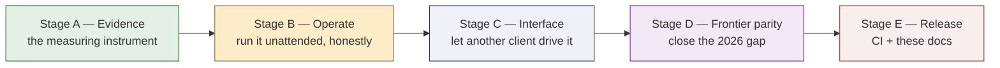

# agent-native v3 — what got built on the v2 architecture

This is the successor to [`native-agent-v2.md`](native-agent-v2.md). That document was a
*target architecture*: eight invariants, a layer map, and a build order (Part 13) that ran
from Stage 0 (domain model and bus) through Stage 6 (sandbox) and named Stage 7 as "the
comparison." By the time v3 began, Stages 0–6 of that plan were built — the whole native core
described in v2 exists in `packages/agent-native` — and a hardening pass had followed it
(migrations and retry on Postgres, honest provider-reported tokens, configurable limits; see
the v2-hardening notes).

v3 is not another redesign. It is the record of what was added *on top of* that core to make
the thesis **showable, operable, usable by other clients, and comparable to a 2026 frontier
agent** — plus an honest account of what was deliberately left unbuilt. The plan it follows is
[`../plan/native-agent-v3-plan.md`](../plan/native-agent-v3-plan.md): thirty-one numbered
steps in five stages, A through E. This document explains what those stages amount to, why
each new capability lands where it does, and where the built code stops short of the plan.

**Scope, unchanged from v2.** `mcp/__init__.py` and `packages/mcp-servers` remain out of scope;
the design still wraps the `MCPClient` protocol without altering it. `packages/agent-langgraph`
is a separate contributor's track and is **never edited here** — v3 builds the harness that will
*measure* it, not the track itself.

---

## Part 1 — The v2 invariants still hold

Nothing in v3 breaks the eight invariants from v2 Part 1, and that is the single most important
property of this stage. Every capability below is either a *consequence* of a v2 seam or a new
implementation *inside* one:

- **The transcript is the state.** Multimodal input (step 20) is new *parts* on the same
  transcript, not a side channel. Resumable runs (step 11) replay the persisted transcript and
  event log rather than reconstructing anything.
- **Everything the model can do is a tool.** Plan-writing, skill invocation, filesystem
  checkpointing, surgical editing and parallel fan-out all arrive as **tools** the model calls
  and sees, not as loop machinery it is trapped inside.
- **Policy is a hook, not a branch.** Plan mode (step 19) is a `PolicyHook` in the same
  `PolicyChain` as the risk and permission hooks; adding it meant adding a policy, not editing
  the loop. Lifecycle hooks (step 16) generalise this to user-registered extension points.
- **The core is headless.** The REST + SSE API (step 12) is a *peer client* of exactly the same
  `AgentService` the CLI and the benchmark runner use — the property v2 insisted on, now
  exercised by a real HTTP surface.
- **Budgets are real; cancellation returns a result; runs are reproducible and replayable.**
  Budget governance (step 9), the reproducibility harness (step 6) and resumable runs (step 11)
  are these three invariants made load-bearing for an unattended benchmark.

If a reviewer wants the shape of the core, read v2. If they want to know what v3 *adds* and what
it *skips*, read on.

---

## Part 2 — The five stages, and why they are ordered so

The order is defended in the plan and worth restating: **Stage A comes first and entire**,
because nothing else in v3 can be *shown* without the yardstick, and a feature you cannot
measure is a claim you cannot defend. Stage B follows because an unattended benchmark needs a
budget ceiling, trace export and resumable runs before it can be trusted to run alone. Stage C
sits on Stage B (the API leans on resumable runs and the async permission channel). Stage D —
the frontier-parity features — is slotted only where Stage A can already measure each addition.
Stage E closes the project with CI and documentation.

### Stage A — Evidence (steps 1–6): the measuring instrument

The thesis claim — that a hand-built agent can match a framework-built one on the same work —
is worth exactly as much as the yardstick behind it, so the yardstick was built first and built
to be honest. The whole harness lives in `packages/evaluation` and is documented in
[`../evaluation/README.md`](../evaluation/README.md); the one rule is that **both tracks meet the
same tasks through the same interface** — a `Track` that hands back a fresh `AgentService`. The
suite is sixteen tasks, versioned `1.0`, across six categories. Scoring keeps a deterministic
pass rate visible next to any LLM-judged one. A reproducibility harness runs the suite twice and
refuses to certify an unstable pass set. Step 4 added run read-back to the `Database` ABC so the
harness reads receipts and event streams from the same store the agent writes to. This stage is
what turns the comparison from *asserted* into *rendered* — see Part 4 of v2 for why that matters
to the thesis, and [Part 4 below](#part-4--what-this-means-for-the-thesis).

### Stage B — Operate (steps 7–11): reliability and observability

An eval that runs for an hour unattended, and an API that serves other people, both need the
run to be *honest about itself* and *safe to leave alone*. Stage B delivered: an OpenTelemetry
OTLP exporter behind `Monitoring.shutdown` (traces flush on exit rather than being lost); run
history and receipts surfaced so a finished run is a durable record, not stdout; **budget
governance** — a cost, token and turn ceiling enforced per run, so a looping model cannot run
up an unbounded bill; **secrets handling and redaction** — one `Redactor` installed into every
sink that stores or ships text (the event bus, the trace exporter, the memory store), so a leaked
key cannot reach a row, a trace file or a log while the conversation itself stays exact; and
**resumable runs** — because every step is written to the event log as it happens, an interrupted
run is picked up from where the log ends rather than restarted, re-running nothing that already
has a saved result.

### Stage C — Interface (steps 12–15): usable by someone else

v2's fourth invariant ("the core is headless") existed precisely so a non-CLI client could drive
the agent. Stage C cashed that in. A **REST + SSE API** (`packages/api`) exposes sessions, runs,
permissions and memories over HTTP, streaming a run's events as Server-Sent Events; it is built
on a framework-free ASGI toolkit so the whole surface is testable offline against the app
callable directly. An **async permission channel** lets a remote client answer a permission
prompt by subscribing to the bus and calling `resolve_permission` — the exact contract v2
promised, now proven over the wire. **Session management** adds list / resume / fork / delete.
A **thin web UI** (a single-page console) ships as a client over those same routes. The full
endpoint contract is in the companion [API reference](api-reference.md).

### Stage D — Frontier parity 2026 (the built subset)

Stage D is where the native agent closes the distance to a 2026 frontier coding agent. Each
feature was built test-first and plugs into an existing seam rather than widening the loop:

| Step | Feature | Seam it plugs into |
|---|---|---|
| 16 | Hooks — lifecycle extension points | `HookManager` shared into the loop and every helper loop |
| 17 | Skills — `SKILL.md` discovery + progressive disclosure | catalogue seeded into the prompt; `InvokeSkillTool` loads a skill on demand |
| 18 | Filesystem checkpoints + rewind | a tool that snapshots and restores the working tree |
| 19 | Plan mode — read-only gate before execution | `PlanModePolicy` in the `PolicyChain`; inert unless `Limits.plan_mode` |
| 20 | Multimodal input (images / documents) | new content parts on the transcript's wire rendering |
| 21 | Extended-thinking budget + reasoning-token surfacing | reasoning tokens carried on `Usage`, budgeted like output |
| 22 | Model routing + fallback | selection over the `ModelRegistry`, falling back on provider failure |
| 24 | Anchor-based surgical edit tool | a tool that edits by matching an anchor, not by rewriting a file |
| 26 | Parallel subagent fan-out | `FanOutTool` maps one helper over many jobs; a helper is handed neither delegation tool |

Fan-out is the clearest illustration of the "everything is a tool" discipline paying parity
dividends: it is one worker mapped over a list of jobs, costing about the slowest child rather
than the sum, each child individually attributable on the parent's event stream, stopped as one
by a single cancel, and capped per child so it cannot multiply into a runaway bill — all without
a new control structure in the loop.

### Stage E — Release (steps 29, 31): harden and document

Step 29 wired **continuous integration**: `.github/workflows/ci.yml` runs one matrix job per
substantive package (`agent-native`, `api`, `evaluation`), each executing the three gates the
project already holds itself to — ruff, mypy, and the pytest suite — against that package's own
pinned tool config. It sets no `GROQ_API_KEY`, so the live Groq tests skip themselves and CI
never touches the network; the evaluation job is what satisfies "the eval suite runs in CI
against a fake provider," driving the whole harness on a scripted model and in-process fake
tools. The per-feature tests the plan lists for step 29 already existed — every Stage D feature
was built test-first — so the workflow was step 29's only remaining deliverable. Step 31 is this
documentation set: this note, the API reference, the reproduction runbook, the updated database
diagram, and the refreshed evaluation README.

---

## Part 3 — Honest deferred scope

A thesis about the *cost* of hand-building an agent is only credible if it is equally honest
about what was not built. Five items from the plan were deferred; none blocks the comparison,
and in every case the seam that would receive the work already exists.

| # | Item | Status | Why deferred, and the seam that is ready |
|---|---|---|---|
| 23 | Web fetch / search tool | Deferred | A capability, not a gap in the architecture: it is one more tool on the existing dispatch/policy path. Left out to keep the offline story clean; adding it later touches no core. |
| 25 | LSP-backed navigation | Removed from plan | Struck from the step list entirely as disproportionate to the thesis; recorded here so its absence is intentional, not an oversight. |
| 27 | Test runner + structured result parser | Deferred | Cleanest as an external server on top of the API; the plan itself notes it and remote MCP (28) belong together, after Stage C. |
| 28 | Remote MCP (stdio / SSE / streamable-http) | Deferred | The `MCPClient` protocol is unchanged and already the seam; remote transports are additional clients behind it, not a core change. |
| 30 | Semantic / vector memory | Deferred (optional) | Explicitly optional in the plan, and behind the same memory seam as today's keyword store. Its paraphrase-recall verification needs a real embedding model that cannot run in the offline gate, so keyword memory stays the default and the vector swap is left as future work. |

The pattern is deliberate: everything deferred is *additive behind an existing seam*, which is
itself a finding — the v2 architecture absorbed a stage of frontier-parity features and five
plausible extensions without a structural change.

---

## Part 4 — What this means for the thesis

v2 Part 14 argued that the honest thing to measure is not structural parity with a LangGraph
mirror but the *cost* of hand-building the properties a framework gives for free — and that this
requires holding the tool layer and the task suite fixed while letting each agent be idiomatic.
v3 is what makes that measurement executable rather than rhetorical.

The native track is now driven over a fixed, versioned suite through a `Track` interface the
runner cannot distinguish from any other; its receipts and tool sequences are read back from the
same persisted event log the agent writes; the numbers are reproducible across repeated runs or
they are not certified. The LangGraph track — a separate contributor's package, a stub today —
will be measured by this *same* harness, unchanged, once it lands: same tasks, same tool layer,
same scoring, its checkpoint tables never reshaped. When both tracks have run, `evaluation
compare` renders the side-by-side report described in
[`../comparison/README.md`](../comparison/README.md), and the reproduction runbook
([`../comparison/reproducing.md`](../comparison/reproducing.md)) is the cold-start path from a
clean checkout to that report.

The frontier-parity work of Stage D changes what the comparison can *say*. A reader no longer has
to take on faith that the hand-built agent is competitive with a 2026 agent on capability; hooks,
plan mode, checkpoints, skills, routing, multimodal, reasoning budgets and parallel fan-out are
present and tested, and the deferred list above says plainly where it still stops. That is the
measurement v2 promised, now standing on evidence.

---

## Part 5 — Where the code and docs live

- **Core (unchanged design, v2):** `packages/agent-native/src/agent_native` — loop, dispatch,
  policy/hooks, providers, persistence, subagents, sandbox.
- **Evaluation harness (Stage A):** `packages/evaluation` — suite, runner, scorers, comparison,
  reproducibility, optional Postgres store. Docs: [`../evaluation/README.md`](../evaluation/README.md).
- **HTTP surface (Stage C):** `packages/api` — framework-free ASGI app + SPA console. Docs:
  [API reference](api-reference.md).
- **CI (Stage E):** `.github/workflows/ci.yml`.
- **This design set (Stage E, step 31):** this note; the [API reference](api-reference.md); the
  [reproduction runbook](../comparison/reproducing.md); the live schema diagram
  [`database-design.mermaid`](database-design.mermaid) (now including the two evaluation tables,
  with the v0.3 whole-system design kept verbatim as a commented appendix); and the refreshed
  [evaluation README](../evaluation/README.md).
- **The plan v3 follows:** [`../plan/native-agent-v3-plan.md`](../plan/native-agent-v3-plan.md).
